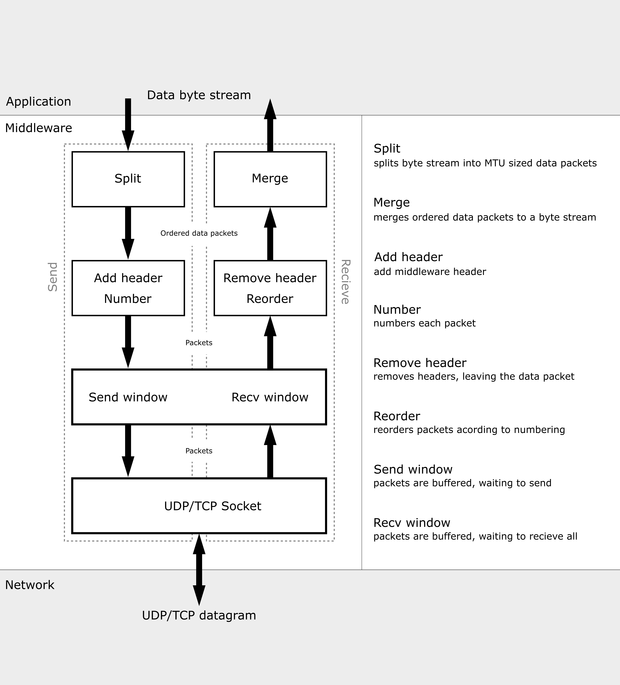

# Middleware

## **System Architecture**



As shown in the diagram, the middleware exposes an API which enables sending and receiving.
The API is split between endpoints for reliable and unreliable communication.
Despite what is shown in the diagram, the API is only byte stream based when using reliable
communication, while the unrealiable part of the API is message based.
With unreliable, the messages are divided into an ordered list of ”data
packets” (fragments) to fit with the Maximum Transmission Unit (MTU) of the network (shown
as ”Split” and ”Merge” in Figure 2).
To reassemble the fragmented packets at the receiving end, a header is prepended with a unique
identifier when sending, and packets are reordered using this information when receiving (shown
as ”Add header, Number” and ”Remove header, Reorder”).
When reliable communication is used, the byte stream is sent and received using TCP, using the configured
TCP options in the config file. For both the reliable and unreliable configurations
it is also possible to set the timeout for blocking operations, as well as the TOS value, through the API.

---

## **API documentation**

Our middleware aims to be equivalent to the Python socket API in the functions it implements, as listed below.

After importing the API, we begin our journey by initializing either a MiddlewareReliable or a MiddlewareUnreliable object. Both
objects have a constructor that accepts an MTU. This MTU is by default set to the value loaded from the middleware config file,
but can be overidden per socket by this argument.

> ### **MiddlewareReliable.connect(address)**
>
> Connect to a remote socket at address. (The format of address depends on the address family — see above.)
>
> If the connection is interrupted by a signal, the method waits until the connection completes, or raise a TimeoutError on timeout, if the signal handler doesn’t raise an exception and the socket is blocking or has a timeout. For non-blocking sockets, the method raises an InterruptedError exception if the connection is interrupted by a signal (or the exception raised by the signal handler).
>
> Raises an auditing event socket.connect with arguments self, address.

&nbsp;

> ### **MiddlewareReliable.send(bytes)**
>
> Send data to the socket. The socket must be connected to a remote socket. The optional flags argument has the same meaning as for recv() above. Returns the number of bytes sent. Applications are responsible for checking that all data has been sent; if only some of the data was transmitted, the application needs to attempt delivery of the remaining data. For further information on this topic, consult the Socket Programming HOWTO.

&nbsp;

> ### **MiddlewareReliable.sendall(data)**
>
> Send data to the connected remote socket. This differs from MiddlewareReliable.send in that it blocks until the entire payload (data) is sent or
> the operation is timed out. Nothing is returned, and an exception is raised if the operation timed out (TimeoutError) or the operation
> would block on a non-blocking socket (BlockingIOError).

&nbsp;

> ### **MiddlewareUnreliable.sendto(data, address)**
>
> Send data to a remote socket with the specified address. An exception is raised on timeout (TimeoutError) or if the operation would
> block on a non-blocking socket (BlockingIOError).

&nbsp;

> ### **MiddlewareReliable.listen([backlog])**
>
> Enable a server to accept connections. If backlog is specified, it must be at least 0 (if it is lower, it is set to 0); it specifies the number of unaccepted connections that the system will allow before refusing new connections. If not specified, a default reasonable value is chosen.

&nbsp;

> ### **MiddlewareReliable.bind(address)**
>
> ### **MiddlewareUnreliable.bind(address)**
>
> Bind the socket to address. The socket must not already be bound. (The format of the address is a tuple: (IP, port))

&nbsp;

> ### **MiddlewareReliable.accept()**
>
> Accept a connection. The socket must be bound to an address and listening for connections. The return value is a pair (conn, address) where conn is a new socket object usable to send and receive data on the connection, and address is the address bound to the socket on the other end of the connection.

&nbsp;

> ### **MiddlewareReliable.recv(buffer_size)**
>
> Receives data from an accepted connection. The amount of data returned is less than or equal to the provided buffer_size. An exception is
> raised on timeout (TimeoutError) or if the operation would block on a non-blocking socket (BlockingIOError).

&nbsp;

> ### **MiddlewareUnreliable.recvfrom()**
>
> Received data and sender address for a received MiddlewareDatagram. An exception is
> raised on timeout (TimeoutError) or if the operation would block on a non-blocking socket (BlockingIOError).

&nbsp;

> ### **MiddlewareReliable.settimeout(timeout_s)**
>
> ### **MiddlewareUnreliable.settimeout(timeout_s)**
>
> Sets the timeout for blocking operations to timeout_s seconds. A value of None makes all blocking operations block, a value of 0 makes
> all blocking operations non-blocking and raise an exception (BlockingIOError) if it would block. A value > 0 will result in an exception
> (TimeoutError) when a blocking operations takes more than timeout_s seconds to complete.

&nbsp;

> ### **MiddlewareReliable.gettimeout()**
>
> ### **MiddlewareUnreliable.gettimeout()**
>
> Gets the currently set timeout value for blocking operations.

&nbsp;

> ### **MiddlewareReliable.set_tos()**
>
> ### **MiddlewareUnreliable.set_tos()**
>
> Sets the TOS value to be sent with outbound packets. When tcp_ecn is enabled (see system_config.ini) TOS values will be
> rounded down to the nearest multiple of 4.

&nbsp;

> ### **MiddlewareReliable.get_tos()**
>
> ### **MiddlewareUnreliable.get_tos()**
>
> Gets the currently set TOS value to be sent with outbound packets.

&nbsp;

> ### **MiddlewareReliable.get_mtu()**
>
> ### **MiddlewareUnreliable.get_mtu()**
>
> Gets the currently set MTU. The socket will never send an IP packet larger than this size.

&nbsp;

> ### **MiddlewareReliable.get_mss()**
>
> Gets the currently set MSS (Maximum Segment Size). This is equal to MTU - TCP/IP headers, and is the
> maximal payload carried by a single TCP segment.

&nbsp;

> ### **MiddlewareUnrelaible.get_mss()**
>
> Gets the currently set MSS (Maximum Segment Size). This is equal to the current MTU - total header size.
> No UDP datagram will be sent with a larger payload than this size. This is applies to each individual
> fragment sent as a UDP datagram, and is different to MiddlewareUnreliable.get_max_payload_size(), which
> applies to a MiddlewareUnreliable datagram (which is composed of fragments, each fragment is sent as
> a separate UDP datagram).

&nbsp;

> ### **MiddlewareUnrelaible.get_max_payload_size()**
>
> Gets the maximum payload a single call to MiddlewareUnreliable.sendto() can handle. This is based on the
> minimum possible MTU (64 bytes) and the number of fragment index bits (currently 11), which yields a
> maximum payload size of 63488 Bytes. Connections with a larger MTU could effectively exceed this, for
> safety, all payloads for all MTU sizes are required to be less than this size.

### **Example usage**

To get started, here is a code snippet to show how to interact with the API and set up basic communication using:
Make sure the import path to middleware.middlewareAPI is correct depending on wherer your project is.

**Unreliable:**

```python
    from middleware.middlewareAPI import *

    mwSend = MiddlewareUnreliable()
    mwReceive = MiddlewareUnreliable()
    mwReceive.bind(("", 5005))
    mwSend.sendto(b"Hello", ("localhost", 5005))
    dataReceived = mwReceive.recvfrom()[0]

    print(dataReceived)

    mwSend.close()
    mwReceive.close()
```

**Reliable:**
Reliable communication requires at least two threads to function, since one will need to connect while the other one accepts.

```python
    from middleware.middlewareAPI import *
    import threading

    def waitForPacket(mwSocket):
        conn, addr = mwSocket.accept()
        assert conn.recv(1024) == b"Hello there"
        conn.send(b"General Kenobi")
        conn.close()

    mwReceive = MiddlewareReliable()
    mwSend = MiddlewareReliable()

    mwReceive.bind(("", 5001))
    mwReceive.listen()
    thread = threading.Thread(target=waitForPacket, args=(mwReceive,))
    thread.start()

    mwSend.connect(("localhost", 5001))
    mwSend.send(b"Hello there")

    received = mwSend.recv(1024)
    print(received)

    thread.join()
    mwReceive.close()
    mwSend.close()
```

### **Configuration options**

Configuration is split into two categories: middleware configuration and system configuration. Each category has an INI file associated
with it in the root directory of the repository.

System configuration must be applied manually by calling the script "configure_system.py"
with sudo. This configure the TCP/IP stack according to system_config.ini. Each option is documented in the INI file.

Middleware configuration is applied automatically when the middleware is loaded as a python module. As opposed to system configuration,
middleware configuration will be loaded from the current working directory of the process that imported the middleware module, with
the middleware_config.ini in the root directory as fallback. Each option available is documented in the middleware_config.ini file
in the root directory. Note that all variables must be set by a middleware config INI file, and there may only be one section called
"middleware_configuration". It is advised to copy to middleware_config.ini file in the root directory and modify this, intead of
writing it from scratch. Additionally, the config system is not yet designed to

Currently, the following options are available in the middleware config file:

- mtu: default MTU assigned to each socket
- fragment_timeout: amount of time to wait after receiving new fragments before discarding the whole datagram
- congestion_algorithm: the congestion algorithm to use for MiddlewareReliable sockets, must be one of the allowed algorithms set in system configuration
- echo_config_path: if true the middleware will print the path of which middleware config file it loaded during initialization

---

## Using the middleware in custom applications

A barebones example of how to use poetry is shown in `example-service/`. This can be used as a starting point to create applications on top of the middleware. Details for how to do this is explained in detail in the [example-service README](./example-service/README.md).

## **Poetry**

**Note:** This is not necessary to run the middleware normally, as no dependencies outside the Python standard library are required!

Do the following while in the subfolder `middleware/`

- To install dependencies: `poetry install`
- To activate virtual environment: `poetry shell`
- To add dependencies: `poetry add [-D] X` (Use -D for development dependencies)
